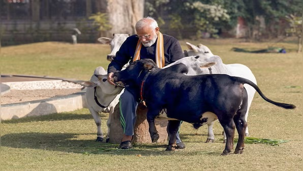

1. Bihar Samastipur District. A Thana Prabhari was killed by the cow butchers. He was shot in the eye.
   1. https://www.aajtak.in/india/bihar/story/samastipur-district-mohanpur-op-police-station-in-charge-nand-kishore-yadav-death-lclp-1758058-2023-08-15
2. In Gujrat, a lady Neha Patel was arrested because she loves cows. She lead many rads of illegal activities.
   1. https://youtu.be/CC3VyqVPM5c?t=1134
3. Bittu Bajrangi, who is a staunch supporter of non other than Modi himself is now in cross hairs. He was arrested.
4. Twitter screen shot.
   1. https://youtu.be/CC3VyqVPM5c?t=985
5. When PM gave those statements on twitter, no one realized whats the motive. And the result was, India is 3rd largest beef exporter, some say its top exporter. 

1. गोमांस का विरोध करने वाली बीजेपी को मीट कंपनियों से मिला 250 करोड़ का चंदा 
   1. https://www.aajtak.in/india/story/bjp-received-rs-2-50-crore-in-donations-from-companies-exporting-buffalo-meat-321090-2015-12-16
    
2. India’s beef exports rise under Modi govt despite Hindu vigilante campaign at home
   1. https://theprint.in/economy/indias-beef-exports-rise-under-modi-govt-despite-hindu-vigilante-campaign-at-home/210164/  

3. Modi govt gave Rs 68 crore subsidy to modernise slaughterhouses, reveals RTI query
   1. https://www.indiatoday.in/india/story/narendra-modi-government-bjp-slaughterhouses-1022430-2017-07-04

अगर भाजपा सत्ता में है तो गौहत्या जायज है ,
भाजपा अगर विपक्ष में तो नाजायज है।
If you are in power, then cow sloter is valid, if you are in opposition, then its invalid.
https://x.com/ErDurgeshPande7/status/1856372003097190772

Beef export company from mumbai chanda donation
https://www.youtube.com/shorts/8OCL2XEuhhM
https://youtu.be/WWe2WRWxtb0?t=157

https://www.aajtak.in/india/story/bjp-received-rs-2-50-crore-in-donations-from-companies-exporting-buffalo-meat-321090-2015-12-16

https://www.deccanherald.com/india/with-fssais-nod-mithun-meat-with-unique-flavour-low-fat-content-to-find-its-way-to-plates-2670120

https://www.business-standard.com/industry/news/mithun-bovine-now-classified-as-food-animal-to-boost-its-meat-trade-123090300630_1.html

A few weeks ago, I posted about Modi strongly attacking Gau Rakshks. And I gave some references. 

Two such statements for you to recall. 

Modis Cow Gimiks

Around 2016, He said Gau Rakshak business makes me angry. He was even suggesting state govts to prepare dossiers for such people. Ref 2 

And then he says

No person in this nation has the right to take the law in his or her own hands in this country: PM. References 4 and 6 

Now did anyone realize what the consequences of these statements.

There are two important consequences that I came across, I will share the first one today. The second may be some other time.

When PM Modi gave those statements, no one realized whats the motive. And the result was, India is 2nd largest beef exporter, some even say we are at top. So here are the sequence of events.

1. Way back in 2013-14 Modi was declared PM candidate. For most, it was love at first sight. Who did not fell for Him? And as he was roaming around campaigning, he talked about Pink Revolution, highlighting it and strongly condemning it on multiple occasions. Ref 12

2. But even before the elections, the BJP was securing donations from beef companies behind the curtains. Ref 13. What do such donations mean? They are deals. I talked about quid pro quo in my last post. So essentially we are paying you, you will not make any policies againest us or will only make policies in our intrest. 

3. In 2014 Modi won, everyone is in high spirits and exited.

4. Then in 2015, this news broke out about beef company donations, but no one noticed, everyone is fully drunk on Modi.  Ref 14. 

5. Come 2016, 17, he made the following statements, and asked state governments to prepare "dossiers" on the so-called cow protectors. Ref 1. 

Then, No person in this nation has the right to take the law in his or her own hands in this country: PM. References 4 and 6 
We are the land of non violence. We are the land of Mahatma Gandhi. Ref. 5
And in this video here, is crying for HIS people. Ref 15

6. Thats it. Any Hindu who had a bit of spine and had some conscience to protect cows became a criminal. And the cow butchers got the free hand. Take a look at Ref 16, 17 and 18. 

7. So this Jhumlendra Bhai Modi talked about Pink revolution in 2013. But his govt gave them 33% more money. Ref 19

8. And the rest as they say is history. India emerges to the top. Ref 20. 

9.  And now Mithun meet is official. Ref 21 and 22

10.   And I even heard that in Rajasthan beef is getting home delivered. 

11.   I talked about Electoral bonds in my last post. So beef exporting companies giving donations via EBs. 

12.  OK, So are you disturbed, depressed? Worry not. Modiji for rescue. Who else?

13. Aahhh... Thanks Modiji. Now am sooooo Proud.

References

Ref 1 

Gau Rakshak business makes me angry.  
The prime minister also asked state governments to prepare "dossiers" on the so-called cow protectors 
https://indianexpress.com/article/india/india-news-india/mygov-townhall-narendra-modi-cow-vigilantes-gau-rakshaks-2958228/ 
6 Aug 2016 

Ref 2 
PM hits out at cow vigilantes, says 'gau rakshak business makes me angry' 
https://www.youtube.com/watch?v=55FjfoUnzNc 

Ref 3 
Gau raksha ke naam pe jo log dukaan khol ke baithe hain, mujhe unpe bada gussa aata hai: PM Modi 
https://twitter.com/ANI/status/761912026398621696 
6 Aug 2016 

Ref  
Kaafi log jo Gau rakshak hain, woh gau raksha sirf apne kaale dhandhe chupane ke liye karte hain: PM Modi 
https://twitter.com/ANI/status/761912287997353984 
6 Aug 2016 

Ref 3 
https://timesofindia.indiatimes.com/india/killing-in-the-name-of-cow-worship-is-not-acceptable-says-pm-modi/articleshow/59367017.cms 
29 Jun 2017 

Ref 4. 
No person in this nation has the right to take the law in his or her own hands in this country: PM 
https://twitter.com/PMOIndia/status/880332771310174208 
29 Jun 2017 

Ref 5.  
We are the land of non violence. We are the land of Mahatma Gandhi. Why do we forget this?: PM Modi 
https://twitter.com/ANI/status/880331976409923584 
29 June 2017 

Ref 6. 
No one has the right to take the law in his or her hands: PM Modi 
https://twitter.com/ANI/status/880333627107586048 
29 June 2017 
 
Ref 7. 
Killing people in the name of Gau Bhakti is not acceptable. This is not something Mahatma Gandhi would approve of: PM Modi 
https://twitter.com/ANI/status/880331037191970818 
29 June 2017 

Ref 8.  
Gai Ke Naam Par Kisi ki Hatya ki jaay.. 
Killing People In Name Of Gau Bhakti Not Acceptable, Says PM Modi 
https://www.youtube.com/watch?v=58Ei7fJVOFk 
https://www.youtube.com/watch?v=pvnjswYaEOg 
https://www.youtube.com/watch?v=0Bv-exLlk38 
29 June 2017 

Ref 9.  
राज्य सरकारों को ये भी देखना चाहिए कि कहीं कुछ लोग गौरक्षा के नाम पर अपनी व्यक्तिगत दुश्मनी का बदला तो नहीं ले रहे हैं। 
https://twitter.com/narendramodi/status/886523855744909312 
16 June 2017 

Ref 10. 
हम सभी राजनीतिक दलों को गौरक्षा के नाम पर हो रही इस गुंडागर्दी की कड़ी भर्त्सना करनी चाहिए। 
https://twitter.com/narendramodi/status/886523958920585217 

Ref 11. 
गौरक्षा को कुछ असामाजिक तत्वों ने अराजकता फैलाने का माध्यम बना लिया है। इसका फायदा देश में सौहार्द बिगाड़ने में लगे लोग भी उठा रहे हैं। 
https://twitter.com/narendramodi/status/886523450558341120 
16 June 2017 

Ref 12. Meera Kaleja roo ra haa hain, cheek cheek kar ke pukaar rahaa hain
https://www.youtube.com/watch?v=woxIJe01IiY&t=81s

Ref 13. Government's 'pink revolution' destroying cattle, says Narendra Modi
https://youtu.be/1ElnjqtBbuc?t=230
https://youtu.be/1ElnjqtBbuc?t=311

Ref 14. https://www.aajtak.in/india/story/bjp-received-rs-2-50-crore-in-donations-from-companies-exporting-buffalo-meat-321090-2015-12-16

Ref 15. https://www.youtube.com/watch?v=58Ei7fJVOFk  

Ref 16. Bihar Samastipur District. A Thana Prabhari was killed by the cow butchers. He was shot in the eye.
https://www.aajtak.in/india/bihar/story/samastipur-district-mohanpur-op-police-station-in-charge-nand-kishore-yadav-death-lclp-1758058-2023-08-15

Ref 17. In Gujrat, a lady Neha Patel was arrested because she loves cows. She lead many rads of illegal activities.
https://youtu.be/CC3VyqVPM5c?t=1134

Ref 18. Bittu Bajrangi, who is a staunch supporter of non other than Modi himself is now in cross hairs. He was arrested.

Ref 19. Modi slammed UPA for subsidising slaughterhouses, but his govt gave them 33% more money
https://theprint.in/india/governance/modi-slammed-upa-for-subsidising-slaughterhouses-but-his-govt-gave-them-33-more-money/329800/

Ref 20. https://thewire.in/trade/who-are-the-biggest-exporters-of-beef-in-the-world

Ref 21. https://www.deccanherald.com/india/with-fssais-nod-mithun-meat-with-unique-flavour-low-fat-content-to-find-its-way-to-plates-2670120

Ref 22. https://www.business-standard.com/industry/news/mithun-bovine-now-classified-as-food-animal-to-boost-its-meat-trade-123090300630_1.html

Ref 23. Eat more beef than chicken, mutton, fish: BJP Minister
https://indianexpress.com/article/north-east-india/meghalaya/eat-more-beef-than-chicken-mutton-fish-bjp-minister-7431666/

Ref 24. https://www.boomlive.in/law/supreme-court-electoral-bonds-lok-sabha-elections-2024-poll-campaign-donors-political-donations-24589

Sachar Committee 
https://youtu.be/cn4InamE8q8?t=1740

1. Test1

2. Test 2
3. Test 3

https://x.com/ErDurgeshPande7/status/1856372003097190772
