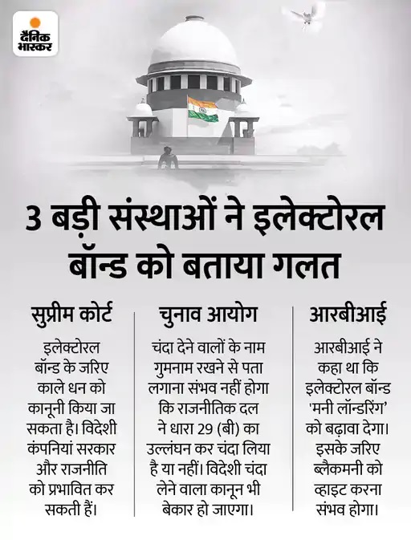
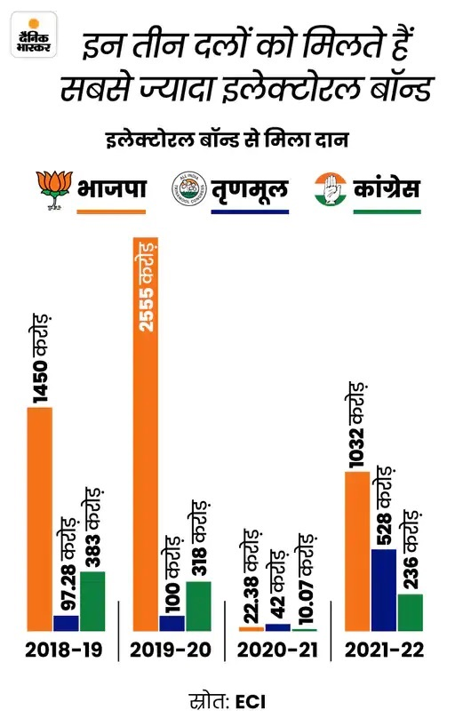
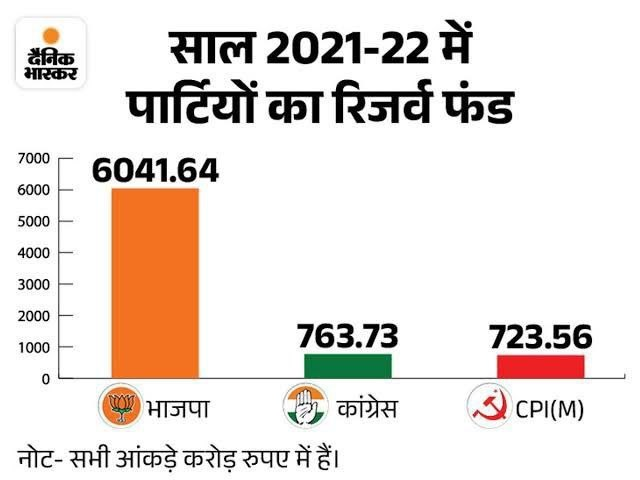

Hare Krishna Prabhuji,
Dandavat Pranams. Please accept my Humble Obeisances.

So did you make any attempt to understand what Electoral Bonds are?

Your post also mentioned "Supreme Court", so are you aware of what that case is in the court?

Here are the details. Spent quite a bit of time preparing this, so please take some time to read this.

1. What are Electoral Bonds(EBs for short)?

It is a bearer instrument payable to the bearer on demand, primarily targeted for political funding.
Say I want to donate 10 lacs to BJP. I can be an individual or even a corporate entity.

I will go to an SBI branch, purchase an EB worth 10 lakhs. 
Then I give that EB to BJP. BJP will then give that EB to the bank and the money will be transferred to the BJP account. 

Note that EB will not contain any details about me, or BJP. I guess it's like a Demand Draft.

2. What is the supreme court case about?
Take a look at Reference 1 given in the end. This gives a good summary.
Also take a look at the full judgment(Ref 2).

In essence, the petitioners said that this new EB scheme will result in non-transparency in political funding and hence corruption.

Almost from the beginning, the RBI and  Election Commission of India(ECI) had objections to this EB Scheme. But Modi hai to Munkin Hai. (Ref 3, 4, 24, 25)

Summary: The Supreme Court held that the Electoral Bonds Scheme was UNCONSTITUTIONAL for violating the right to information of voters.
Essentially, voters will not be able to know who is funding the political parties and how they influence the parties and govts.
SBI directed to immediately STOP issuance of all Electoral Bonds and submit all details to the Election Commission. ECI publishes ALL details on its website.
See Ref 5.

Points to note.

1. It's a 5 Judge bench. And the decision was unanimous. Meaning all the 5 judges were of the same view that EBs are unconstitutional. 
So it's not a 4-1 or 3-2 judgment. This is important.

2. Say I purchase a bond to donate 10 lacs to Congress this time. 
The bond by itself will not contain any of my details. 
But the SBI bank will have to do a Know Your Customer(KYC). Ref 18
So the bank will have my full details. 
Which further means the government will know that I have donated 10 lacs to congress. 
Then Modi/Amit Shah will get angry, and will release ED, IT, CBI weapons on me. 
Then I have no choice but to grind my nose on the ground till its completely flat. 
Then perform an elaborate Aarti to the Great Narendra with full one crore, and no less, as Dakshina this time.
Now see Ref 6, 7, 8 and 25. 

Reserve Fund.

So BJP gets more than 1000 crore per year.
Opposition is done. Small parties are also finished. 
Only the parties that are in power, be it center or state, will get the funds.
That means, kick backs, Quid pro quo(something for something). 
I give you money, you will make policies in my interest.

3. Voters fundamental right to information, Article 19 clause 1, is violated. See Ref 11.

4. This is important. The Attorney General for India said "Citizens DO NOT have a general right to know regarding the funding of political parties. Right to know is not a general right available to citizens". See Ref 12 and 13.
So the public in general cannot know the source of 6000+ crore funds to BJP.

5. A typical candidate can only spend around 1 crore during his election process as per ECI. 
So for general elections, BJP needs a maximum of 600 crores. But BJP is accumulating in thousands.

6. A company can give donations only if it's existing, and make a profit of 7.5 percent. 
But the Modi govt removed this limitation of 7.5 percent. This means loss making companies or shell companies can be created to route funds to parties. See Ref 14. 

Why will a loss making company give a donation to a party?

So Modi has opened the door to get funds through shell(fake) companies.

Think about it. Is this not corruption? CJI DY Chandrachud mentioned this. A company without a balance sheet can now route money to political parties.

7. How many of you know about Foreign Contribution Regulation Act, FCRA? The Modi government diluted it way back in 2018. Ref 15 and 16. This means any political party can now get foreign funds without scrutiny. This is a violation of Representation of the People Act. See Ref 20. 
 
So why will any foreign entity give funds to parties in India? Say a foreign entity wants to give a donation to BJP, all that they have to do is to open a shell company in India here and through it, it can sneak in any amount to BJP. General public cannot even know these things(See point 4 above and Ref 12 and 13). This means foreign entities have hijacked indian policies.

Does anyone realize the seriousness of this? This is much more serious than UPA's 2G Spectrum and coal gate etc. That's because they were only corruption cases. But here, democracy and the country's sovereignty is now in serious question. This is a VERY BIG SCAM. Its a plan to subvert democracy. This is why the Court struck this down unanimously.  

Please note this point and the one before (point 6). If I expand on these two, the post will be too long. So maybe some other time.

8. So in essence, the party which promised to curb black money, now has a fair and lovely scheme to make black money to white. Vijay Mallya, Nirav Modi, and Sanjay Bhandari. Do any of you remember them? Will they ever come back? 

9. Around 15 lac crores of bad loans are written off by Modi Govt(Ref 17). Do you know why? Just give some donation using EBs and your loan will be written off. Moreover no one will ever come to know about it.

10. Small Parties with less than 1% votes cannot get any donations. So only big players. Ref 19.

11. This will pave the way to Money Laundering. You all know about PMLA right? The RBI objected to this. Ref 21. 

12. Overall, the judgment is a tight slap by the Court. But he is a seasoned politician. Which means he is shameless and can go to any extent defending himself. And now he releases this another classic Jhumla, as if Sudhama has given 100 crore secretly behind the doors and struck a quid pro quo deal with Krishna(Ref 22).

13. Finally, SBI will now need to submit all of the details of EBs sold so far to ECI before 6th March. ECI will then publish them. Ref 23.

14. So will the Modi Govt allow itself to get naked by revealing all of the donors names? I don't think so. I think the Modi Govt will do whatever necessary to HIDE the info. What do you all think?

15. So Yes, Aayee gaa to Modi Hi. Aab Ki bar Chaar Sauw Paar.

References
Ref 1. Summary of the entire case. 
https://www.scobserver.in/cases/association-for-democratic-reforms-electoral-bonds-case-background/

Ref 2. Full Judgment 
https://www.scobserver.in/wp-content/uploads/2021/10/Electoral-Bonds-judgement.pdf
Or
https://main.sci.gov.in/supremecourt/2017/27935/27935_2017_1_1501_50573_Judgement_15-Feb-2024.pdf

Ref 3. Page 13 of the Full Judgment(Ref 2 above)

Ref 4. Page 16 of the Full Judgment(Ref 2 above)

Ref 5. https://twitter.com/LawTodayLive/status/1758001984970571931

Ref 6. https://twitter.com/barandbench/status/1758087276914221254

Ref 7. https://twitter.com/barandbench/status/1758106451753804048

Ref 8. https://twitter.com/barandbench/status/1758106451753804048/photo/1

Ref 9. https://twitter.com/barandbench/status/1758133165863112775

Ref 10. https://twitter.com/barandbench/status/1758133165863112775/photo/1

Ref 11. Page 43, 50, 51, 52, 54, 55 etc. of the Full Judgment(Ref 2 above)

Ref 12. Point d, Page 36, of the Full Judgment(Ref 2 above)

Ref 13. https://english.jagran.com/india/electoral-bond-scheme-citizens-dont-have-fundamental-right-to-know-sources-of-political-funds-centre-tells-sc-10110709

Ref 14. Point J of Page 39 of the Full Judgment(Ref 2 above)

Ref 15. https://zeenews.india.com/hindi/india/lok-sabha-without-debate-passes-bill-to-exempt-political-parties-from-scrutiny-on-foreign-funds/381462

Ref 16. https://www.financialexpress.com/india-news/modi-govt-legitimises-foreign-poll-funding-subramanian-swamy-calls-it-terrible-what-you-must-know/1107290/

Ref 17. https://www.thehindubusinessline.com/money-and-banking/banks-write-off-1456-lakh-crore-npas-in-last-nine-financial-years/article67167970.ece

Ref 18. Point ii of page 38 of the Full Judgment(Ref 2 above)

Ref 19. Point i of page 38 of the Full Judgment(Ref 2 above)

Ref 20. Point (iii) on Page 17 of the Full Judgment(Ref 2 above)

Ref 21. Point 46 in Page 195 of the Full Judgment(Ref 2 above)

Ref 22. https://youtu.be/RbzKZdSDVEs?t=120

Ref 23. PART H, point 219 - b, c, d and e of Page 151 of the Full Judgment(Ref 2 above)

Ref 24. Point 20 and 21 in Page 15, 16 of the Full Judgment(Ref 2 above)

Ref 25. https://www.bhaskar.com/national/news/election-donation-political-parties-bjp-congress-aam-aadmi-party-opinion-132079671.html

----------------------------------------------------------------------------------------------------------------

You: For all the baseless arguments you are providing are you going to make congress or some other party win the elections and create more trouble?
Ans: I dont think, you read the post completely top to bottom. I suggest you go through it once again. Open that on a computer, not on mobile. 
What you are saying is baseless. Incontrast to that, all my points are based on judgement delivered by top courts top judge. Whatever I say is based on some evidence or the other. Nothing out of my mind.

You: He legalized the donations to parties. Previously there was no accountability and that’s how congress looted for decades
Ans: I have explained everything step by step in detail. But still you did not seem to understand anything. Its true that he legalized the donations to parties. But that law itself is declared unconstitutional. Read it once again. 
You said "Previously there was no accountability". 
What did the judgement say? See the judgement summary. Electoral Bonds Scheme is "violating the right to information of voters". "Voters will not be able to know who is funding". So tell me what accountability are you talking about?

You: But atleast he has done remarkably better than previous congress regimes. 
Ans: WRONG. He is a failure in everyfront, be it economy, internal and external security, youth employment, inflation, you name it. 

You: You are highlighting the handful of black spots on a large white board missing/overlooking the good things
Ans: COMPLETELY WRONG. First, there has never been a Prime Minister in this country who lied to the public as much as him. He built his entire carrer on the blood of innocent hindus. 
He killed thousands of innocent hindus and many more are thrown in jail on false cases. 
Also there is no one in the last 200 years of Indian history that I am aware of, who comes even close to this Jihadi Modi on distroying Hindu temples. The number of temples he wiped out is outragious, you simply cannot count.

You: Pr the reality is until we have a better alternative we have to choose the best of available options
Ans: Any tom dick and harry is better than this Islamist Jihadi called Modi.

You: Choose your enemies wisely
Ans: Yes, first you recognize who your enemy is.

You: Please also refer to Jaichand and Prithviraj Chauhan story
Ans: This man, PM Modi is the biggest fraudsters in modren India

Same question to you as well.
Whatever opinion YOU have formed is also because of someone. 
And Yes, exactly what I say to you all - Don’t trust too much in false propaganda. 
There is a reason why I said "PM Modi is the biggest fraudsters in modern India"

The edifice of our spiritual practice is we always consider ourselves Les qualified, less knowledgeable than our spiritual preceptors. On the strength of that merit, it is no-brainer for us to trust and follow our sikhsha and deeksha gurus. Gauranga pr, maharaj are all supportive of Modiji
I have not seen Srila Guru Maharaj is supportive of Modiji. 
And regarding HG Gauranga Pr supporting Modiji, yes I saw that, and I consider that a very serious mistake.

And we dont have to be a blind follower. You can always disagree with someone. If you have a differnet opinion why not express it.
Not only HG Gauranga Pr, HG Gaur Hari Pr here as well was supportive of Modiji. Also here in the same group, there is HG Manobhiram Prabhu, he was a member of BJP and I think he is still in BJP.
Today the status is, when I say something, they take it very seriously simply because they have never hear of those facts and dont have any counter arguments or facts.

RSP: Few things you can directly see prabhu if you wish to see. If you close your eyes and pretend that there is no development then nobody can help. Under his leadership article 370 was removed, infrastructure developed across India, foreign policy never was so strong (surgical strikes is basically a declaration of war, he did it), Ram mandir (all spiritual gurus commended that it was possible due to modiji , LPG supply, rural development, airports, vande Bharat and many more

Just opening eyes is not enough because the fog of propaganda so thick that you simply cannot see whats happening.
Article 370 was removed, but did you tried to scratch beyond the surface. Did you try to understand how rapidly things are degrading and islamization is happening. Do you know why its happening?

Foreign policy. This is the lowest time for Foreign policy. 

And with Ram Mandir, you have no idea how badly this was messed up and with purpose.

You: Previously calling ourselves hindu was considered a taboo but now we can do it with dignity. 
Me: Which world you are living in? 

You: All radical minorities are under check for most part to supress Hindu voice
No single major terrorist attack pr , it’s not easy to secure country with notorious neighboring countries
Me: All of your statements are absurds in their own right, but these two, I consider the most stupid.

So let me introduce to whats called the RULLS database. Have you heard of this before?

