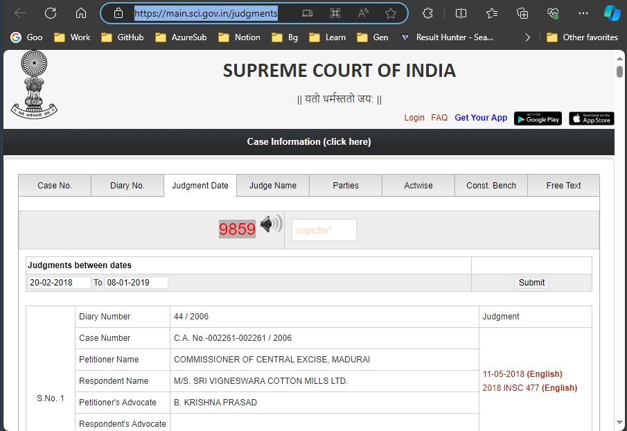

How an American father tracked, located his daughter killed by Hamas in Israel
American millionaire businessman Eyal Waldman's daughter Danielle was among the hundreds killed by Hamas when they attacked the music festival in southern Israel on October 7. Danielle was attending the music festival with her partner at the time of the attack.

https://youtu.be/51w-teUFHuk?t=174

https://twitter.com/MehboobaMufti/status/1730962710517645651

Mehbooba Mufti

Glad to know that UAPA charges against SKUAST students have been dropped. Finally good sense has prevailed & their future saved from jeopardy.

https://indianexpress.com/article/india/uapa-charges-dropped-against-7-kashmir-varsity-students-9051648/

Devendra Fadnavis

https://indianexpress.com/article/cities/mumbai/we-are-against-uddhav-thackerays-minority-appeasement-politics-maharashtra-dy-cm-fadnavis-8520282/

We are against Uddhav Thackeray’s minority appeasement politics: Maharashtra Dy CM Fadnavis | Mumbai News - The Indian Express

https://twitter.com/ANI/status/1722164827777577396

#WATCH | Maharashtra CM Eknath Shinde along with Deputy CM Devendra Fadnavis inaugurated the new office of the Maharashtra State Waqf Board in Mumbai

Amit Shah On waqf board Property, digitization of waqf properties.
https://www.youtube.com/watch?v=DBL3ZQwYbu0

https://twitter.com/SIRBLOFELD/status/1572925190274949123
https://twitter.com/RituRathaur/status/1572922373451714561

Maharashtra CM Eknath Shinde along with Deputy CM Devendra Fadnavis reduces slaughter charges from 200 to 20
https://youtu.be/fu4l4wDQoQA?t=570

Maha govt commissions study to assess social, financial status of Muslims
Tata Institute of Social Sciences (TISS)
https://www.business-standard.com/article/current-affairs/maha-govt-commissions-tiss-to-assess-social-financial-status-of-muslims-122092300580_1.html

In major push to mainstream Muslim community, Maharashtra govt appoints TISS to study ways
https://www.firstpost.com/india/in-major-push-to-mainstream-muslim-community-maharashtra-govt-appoints-tiss-to-study-ways-11316091.html

New Problems after 2014.
Stone pelting was a problem only in Kashmire, now its a country wide problem.

New India means Pasmanda Bharat.

BJP govt. of Maharashtra increases govt guarantee to Maulana Azad Minorities Financial Development Corporation from Rs 30 crore to Rs 500 crore

Maharashtra cabinet on Wednesday cleared the proposal to increase government guarantees to Maulana Azad Minorities Financial Development Corporation from Rs 30 crore to Rs 500 crore, to avail loans from National Minorities Development and Finance Corporation (NMDFC).

https://newsum.media/maharashtra-increases-govt-guarantee-to-maulana-azad-minorities-financial-development-corporation-from-rs-30-crore-to-rs-500-crore/

True colors of Modi. 

Modi himself explianing if muslims 

मोदी का सही स्वरूप अगर मुसलमान जान जाएँगे तो मुसलमान मोदी से प्रेम करने लग जाएगा और ये बेचारे बहुत “भोले-भाले” हैं। भगवान अगर मुझे अवसर दे तो मैं सबसे ज़्यादा इनका भला करूँगा

If Muslims know the true nature of Modi then Muslims will start loving Modi and these poor people are very “innocent”. If God gives me a chance, I will do the most good to them.

अब भी समय है हिंदुओं मोदी का सही स्वरूप जानलो मोदी केवल और केवल मुसलमानों के लिए ही काम कर रहे हैं॥

BJP Love Jihad

फर्क सिर्फ नीति, नीयत और नेतृत्व का है। पहली की सरकारों ने जहां अल्पसंख्यक वर्ग के विकास पर नहीं दिया कोई ध्यान, वहीं मोदी सरकार ने सुनिश्चित किया सबका साथ - सबका विकास।

https://twitter.com/BJPMinMorcha/status/1729257157529625039

Sabka Ssath, Sabka Vikas, Sahka Vishwas Sabka Prayaas
Hindu ka Sath, Pasmanda Ka Vikas, Arbi Hukmaron ka Vishvas, and Modi ka Prayas.
They never say this before the election. Only after the election.

All judges have the same middle name. God
https://youtu.be/c0UEM5wHie4?t=447

imam e hind, imam-e-hind, Indresh Kumar

https://twitter.com/RituRathaur/status/1735246581488873562/photo/1
https://twitter.com/RituRathaur/status/1735246581488873562/video/2
https://www.awazthevoice.in/society-news/indresh-kumar-asks-indians-to-celebrate-ram-temple-at-ayodhya-25049.html
https://english.bharatexpress.com/india/celebrate-the-festival-of-grandeur-as-imam-e-hind-ram-resides-in-ayodhya-temple-indresh-kumar-100903

Never ever think this just any other statement. This is well thought-out plan. 

"..I am from RSS, we've never said in our discourse in the Sangh training camps that we're rightist. Many of our ideas are like leftist ideas..." said RSS leader Dattatreya Hosabale while releasing a book – The Hindutva Paradigm written by RSS leader Ram Madhav in Delhi  
https://twitter.com/ANI/status/1451616599937454080

मोदी ने कहा- रमजान से पहले घर आएंगे सऊदी अरब की जेल में बंद 850 भारतीय
https://www.bhaskar.com/national/news/pm-narendra-modi-say-indians-jailed-in-saudi-arabia-will-come-home-before-ramzan-01538567.html
Indians jailed in Saudi Arabia will come home before Ramzan: Modi
https://www.babushahi.com/full-news.php?id=86654&headline=Indians-jailed-in-Saudi-Arabia-will-come-home-before-Ramzan:-Modi
https://twitter.com/rkpoickad/status/1737023831326466080

IT BHU Insident.

Current state of UP.

Case againest, Up Congress President Ajay Rai 

https://twitter.com/upadhyayabhii/status/1741901022019322083
https://twitter.com/upadhyayabhii/status/1741684567394926992

Media is completely siglent. 
https://twitter.com/SandeepGuptaINC/status/1741477760793809352

https://navbharattimes.indiatimes.com/state/uttar-pradesh/varanasi/all-accused-of-gangrape-of-iit-bhu-student-turned-out-to-be-bjp-leaders-case-was-registered-against-ajay-rai-for-taking-their-names/articleshow/106417473.cms

https://twitter.com/shivayadav87/status/1741759508261798105

ISI agents arrested in Madhya Pradesh linked to BJP; party leaders privately express anguish over possible infiltration

https://www.indiatoday.in/india/story/isi-agents-arrested-in-madhya-pradesh-linked-to-bjp-party-leaders-privately-express-anguish-over-possible-infiltration-960106-2017-02-10

https://youtu.be/SPcBGLDqeQQ?t=1053

RTI is a joke today.

https://timesofindia.indiatimes.com/city/nagpur/central-railway-chief-pro-shunted-after-rti-spells-out-cost-of-pm-selfie-booths/articleshow/106499873.cms

https://timesofindia.indiatimes.com/city/nagpur/railway-official-who-gave-pm-selfie-booths-cost-info-shunted/articleshow/106494991.cms

Railway Transfers Honest Officer who gave PM Modi Selfie Booth Cost | New Video 2023
https://www.youtube.com/watch?v=F_AlSMQmPts

Officers In Charge of CAG Reports on Ayushman Bharat Graft, Bharatmala Cost Irregularities Transferred

The two reports put the BJP-led Union government on the backfoot after the opposition accused it of presiding over "scams" in flagship schemes. The parties demanded accountability from Prime Minister Narendra Modi. After The Wire published its reports, the CAG, in a press release, called them 'erroneous and baseless'.

https://thewire.in/government/officers-cag-reports-ayushman-bharat-bharatmala-transferred

https://timesofindia.indiatimes.com/india/congress-attacks-govt-over-transfer-of-cag-officers-involved-in-audit-of-dwarka-expressway-ayushman-bharat-schemes/articleshow/104342254.cms?from=mdr

https://www.thenewsminute.com/news/cag-transfers-officers-in-charge-of-reports-that-flagged-graft-in-govt-projects

The only footage westren media have is what the ccp wants them to see.
https://youtu.be/aBIYQTXDwqw?t=115

Disconnect and apathy, I dont care.
https://youtu.be/oUtiMYF8c7I?t=318

FRI againest udhayanidhi stalin
https://youtu.be/CfT30XWzNtM?t=129

J&K Islamikaran
https://youtu.be/CfT30XWzNtM?t=4409

Amrutkaal इमरतीलाल का अमृतकाल! || #ISD || Sandeep deo || Akshay Kapoor || Dr. Shilpi Tiwari
https://youtu.be/tVhtAQVMQXc?t=211

My Response.

I will tell why I felt he resembles Gandhi, just need a couple of days. Its simple, not complicated. Need to pull out the facts.

Meanwhile,

--------------------------------------------------------------------------------------------------------

Everyone is aware of RTI right? The Right to Information act, the UPA govt brought it out way back in 2005.

For many months now, I have been hearing that this RTI has become a joke, becuase pple file an RTI, then its pending for a long time, then the govt would say, the requested info doest not come under RTI and so the govt cannot provide the info. There was also a talk that RTI is slowly dying. See Ref 3.

I was sceptical of such claims. An individual files a request, and the authority will provide if it is within his perview. Simple.

Boy I was wrong. 

Then I came to know about this news where a Railway officer is transfered abruptly. He revealed info regading the cost of PM Modi selfie booths. Ofcourse as a reponse to RTI, he simply did his duty. See Ref 1.

I was not surprized by such transfers, because a few months ago CAG officers were transfered by the govt for exposing corruption. See Ref 2.

So the message here is silent and clear. If something govt does not want you to know, you just cannot know. And the govt officers better be careful before giving out any info to the public which the govt(Modi) does not like.

Hmm...Felt like we are slowly and studily moving towards China. In China the govt spends billons to ensure the only footage westren media have is what the ccp wants them to see.

Its much better during UPA. People could talk freely then. And because of that, UPA fell. 
Today if you ask a question, you are called a congressi. Anything againest Modi is today is an offence againest the country, Hindu relegion.

Ref 1:
http://timesofindia.indiatimes.com/articleshow/106499873.cms?utm_source=contentofinterest&utm_medium=text&utm_campaign=cppst

Ref 2:
https://timesofindia.indiatimes.com/india/congress-attacks-govt-over-transfer-of-cag-officers-involved-in-audit-of-dwarka-expressway-ayushman-bharat-schemes/articleshow/104342254.cms?from=mdr

Ref 3:
https://thediplomat.com/2023/08/modi-government-acts-to-hasten-the-slow-death-of-indias-right-to-information-act/

--------------------------------------------------------------------------------------------------------

PM hits out at cow vigilantes, says 'gau rakshak business makes me angry'
https://www.youtube.com/watch?v=55FjfoUnzNc

Gau Rakshak Business Makes Me Angry Says PM Modi
https://www.youtube.com/watch?v=wwTBNzGlkcs&t=101s

https://twitter.com/narendramodi/status/761973491478388736
https://twitter.com/ANI/status/761912287997353984

Killing people in the name of Gau Bhakti is not acceptable. This is not something Mahatma Gandhi would approve of: PM Modi
https://twitter.com/ANI/status/880331037191970818

We are the land of non violence. We are the land of Mahatma Gandhi. Why do we forget this?: PM Modi
https://twitter.com/ANI/status/880331976409923584

There is absolutely no need for anyone to take the law in his or her hands & disturb the spirit of harmony & togetherness.
https://twitter.com/narendramodi/status/761973624140017665

गाय को हमारे यहां माँ मानते हैं,लोगों की भावनाएं जुड़ी हैं। लेकिन यह समझना होगा कि गौ रक्षा के लिए कानून हैं और इन्हें तोड़ना विकल्प नहीं है
https://twitter.com/narendramodi/status/886523664719421440

सच्चे गौ पूजकों एवं सेवकों से प्रार्थना- आप भी सजग रहिए, कहीं आपका ये उम्दा कार्य मुट्ठी भर लोग अपने निजी स्वार्थ के लिए तबाह ना कर दें।
https://twitter.com/narendramodi/status/762291529369030656

गौरक्षा को कुछ असामाजिक तत्वों ने अराजकता फैलाने का माध्यम बना लिया है। इसका फायदा देश में सौहार्द बिगाड़ने में लगे लोग भी उठा रहे हैं।
https://twitter.com/narendramodi/status/886523450558341120

राज्य सरकारों को ये भी देखना चाहिए कि कहीं कुछ लोग गौरक्षा के नाम पर अपनी व्यक्तिगत दुश्मनी का बदला तो नहीं ले रहे हैं।
https://twitter.com/narendramodi/status/886523855744909312

हम सभी राजनीतिक दलों को गौरक्षा के नाम पर हो रही इस गुंडागर्दी की कड़ी भर्त्सना करनी चाहिए।
https://twitter.com/narendramodi/status/886523958920585217

The result is cow thieves are jubiliant, and who ever was trying to protect cows are now in in hiding. And they can be thrown in jail quoting any reason. Do you know Bitto Bajrangi?

State Governments and UTs will be requested to consider the 
recommendation for posting of Muslim police personnel in thanas 
and Muslim health personnel and teachers in Muslim concentration 
areas. –MHA 
Health & Family Welfare, Human Resource Development andDepartment 
of Personnel & Training will issue appropriateguidelines. Department 
of Personnel & Training will be thenodal department for monitoring 
this. - D/o Personnel & Training

https://minorityaffairs.gov.in/WriteReadData/RTF1984/1658732073.pdf

Communal forces in in India.
https://youtu.be/mBJJNbL04g4?t=2773

This Modi romes around the world with his 56 inches proving them wrong. 

Because of this Modi Govt, entire hindu community is denigrated all over the world now.

https://southasianvoices.org/the-bjp-and-the-rise-of-communal-violence/
https://www.aljazeera.com/opinions/2020/3/11/the-bjp-has-incited-hatred-it-can-no-longer-stop

https://www.abplive.com/news/world/saudi-arabia-foreign-affairs-minister-prince-faisal-bin-farhan-bin-abdullah-back-stand-on-india-jammu-kashmir-muslim-2500674
https://www.livehindustan.com/national/story-saudi-arabia-shocks-india-gives-controversial-statement-on-muslims-of-jammu-kashmir-in-oic-meet-8744763.html
https://www.youtube.com/watch?v=CfT30XWzNtM&t=4409s

https://youtu.be/Kp46Zl4hBNA?t=115
We dont accept that hinduism is a relegion. Its a way of life.
https://economictimes.indiatimes.com/news/politics-and-nation/hinduism-not-a-religion-but-a-way-of-life-pm-narendra-modi/articleshow/46955738.cms
https://www.youtube.com/watch?v=mehRor0WwPw

https://youtu.be/Kp46Zl4hBNA?t=235
I dont do vote bank politics. Governments come and go 

Stones deites statue deities Incredible India
"क्या उन पत्थरों और मूर्तियों में Incredible India है क्या?" प्रधानमंत्री मोदी, जर्मनी दौरे के दौरान।
https://www.facebook.com/IndiaSpeaksDaily/videos/%E0%A4%95%E0%A5%8D%E0%A4%AF%E0%A4%BE-%E0%A4%89%E0%A4%A8-%E0%A4%AA%E0%A4%A4%E0%A5%8D%E0%A4%A5%E0%A4%B0%E0%A5%8B%E0%A4%82-%E0%A4%94%E0%A4%B0-%E0%A4%AE%E0%A5%82%E0%A4%B0%E0%A5%8D%E0%A4%A4%E0%A4%BF%E0%A4%AF%E0%A5%8B%E0%A4%82-%E0%A4%AE%E0%A5%87%E0%A4%82-incredible-india-%E0%A4%B9%E0%A5%88-%E0%A4%95%E0%A5%8D%E0%A4%AF%E0%A4%BE-%E0%A4%AA%E0%A5%8D%E0%A4%B0%E0%A4%A7%E0%A4%BE%E0%A4%A8%E0%A4%AE%E0%A4%82%E0%A4%A4%E0%A5%8D%E0%A4%B0%E0%A5%80-%E0%A4%AE%E0%A5%8B%E0%A4%A6%E0%A5%80-%E0%A4%9C%E0%A4%B0%E0%A5%8D%E0%A4%AE/545725203764874/

acypl welcomes pm @narendramodi (India to US 1993) back to DC! Here, he's outside of the @WhiteHouse in 1993
https://twitter.com/ACYPL/status/516604674670350336
https://www.acypl.org/who-we-are/notable-alumni/

Its not that I have can apply to ACYPL and I may get an admission into it. ACYPL pple pick and choose a person, give them shcolorships etc. 

How and why did they pick Modi? Its a mistery today. 

Every recruitment into Indian Army, even the lowest level soldiers need background verification. 
Whenever an army man goes on leave, he has to mention the address where he is going. Thats with in india. If he has to go outside of India, he has to take special permission.  

Why cant we question Modi? Why did he not declare this, that he has taken training from ACYPL America? What happened in that training? What is tought?

What if these questions are asked in the parlament?

What ever he accuses of congress, he himself does it.
https://www.youtube.com/watch?v=Fl1dC3si070

https://youtu.be/JSbEY1e6cKc?t=3515
Gujarat HC sentences 4 Gujarat cops police to 14 days in jail for public flogging of 5 men

What is their crime? The police had punished stone pelters. 
How dare the police do that? 
So what did that double engine Sarkar do?
Filed a case againest them. 
Yup!! The BJP Sarkar, the Hindu Hriday Samraat sarkar, Aache din lane wale sarkar has filed case againest the police.

The message is silent and clear. 
Dare not even look at Modi's own pple. 

https://www.hindustantimes.com/india-news/4-gujarat-cops-sentenced-to-14-days-in-prison-for-publicly-flogging-muslim-men-101697702779322.html
https://www.newindianexpress.com/nation/2023/Oct/20/gujarat-hc-sentences-4-cops-to-14-days-in-jail-for-public-flogging-of-5-men-2625613.html

https://youtu.be/JSbEY1e6cKc?t=3700

The Army officers are court marshelled, treating them like regular offenders.
What is the offence? They encountered the jihadies.
And what do you expect, the supreme leader got angry. 
See for your self how this man is bragging blatently about it. 
He is saying, my govt has launched an FIR aginest army for the first time. 
https://www.youtube.com/watch?v=cZuT1DRqLPI&t=1560s
He is systematically removing the spine from the armed forces, what to speak of regular Hindus.
This happened 9 years ago, and boy, did we ever knew it?
Even after look at this Video, still pple think this man to be Hindu Hriday Samrat, then only Lord Ram can help.
Just think about it.
Here comes this man to give justice to Kashmiries. So the army is doing injustice to Kashmiries right?
Is this not the nerative of the Pakistan? What does Anti India forces say?
Isnt this Jihadi Modi building the exact same nerative?
Can you imagine the morale of the Armed forces.

Do you know why BJP sarkar is delaying 2021 census. 
Every this is degitilised and Aadhar is manditory. Govt has all the data. 
Any one with a mobile has to reveal that data to the govt, the Aadhar number etc.
But the govt does not want to others to know the same data.
Another reason is Pasmanda number is double.
https://youtu.be/JSbEY1e6cKc?t=3868

In Western utter pradesh, brutal killings of saints, Brahmana, pujaries are today rampent.
So congratulations for the Ram Rajya.
https://youtu.be/JSbEY1e6cKc?t=3947
https://www.jagran.com/uttar-pradesh/ayodhya-assistant-priest-of-hanuman-garhi-murdered-by-slitting-his-throat-when-police-reached-there-he-found-a-blood-soaked-body-23560082.html

चौथी के छात्र ने हिंदू सहपाठी को ब्लेड मारा, शिकायत पर घरवालों को बुलाया: मुस्लिम अभिभावकों ने कक्षा में घुस बच्चों को गला घोंटा, 2 गिरफ्तार
https://hindi.opindia.com/national/muslim-student-studying-in-class-4-in-vadodara-hit-a-hindu-student-with-a-blade/
Double Engine Gujarat Model | Bjp Leader Kamal Rawat Champawat | Pushkar Singh Dhami |New Video 2023
https://www.youtube.com/watch?v=Y6E0lmgp1TA&t=53s

Prime Minister Narendra Modi’s washerman from 1970s dies in Godhra
https://www.youtube.com/watch?v=_HJan2WXiQM&t=274s
Narendra Modi spent a decade in the Rani Masjid Godhra as RSS Pracharak | New Video 2023

https://youtu.be/IR8xH_wzWJU?t=683
Fake government office in Gujarat swindled over Rs 4.15 crore govt funds in three years, two held
https://www.deccanherald.com/india/gujarat/fake-government-office-in-gujarat-swindled-over-rs-415-crore-govt-funds-in-three-years-two-held-2745636

https://youtu.be/IR8xH_wzWJU?t=752
Gujarat ex-IAS officer arrested for running fake govt offices, siphoning Rs 18 crore
https://indianexpress.com/article/cities/ahmedabad/gujarat-ex-ias-officer-arrested-for-running-fake-govt-offices-9046404/
Ex-IAS officer arrested over Rs 18 crore scam
http://timesofindia.indiatimes.com/articleshow/105579824.cms?utm_source=contentofinterest&utm_medium=text&utm_campaign=cppst

BJP to deploy 30 lakh social media workers for 2024 polls
https://indianexpress.com/article/cities/mumbai/bjp-to-deploy-30-lakh-social-media-workers-for-2024-polls-8968860/

Modi Mocks At KCR’s Nimbu Mirchi Rituals, Brands Him Insecure Leader
https://m.sakshipost.com/telangana-politics/2018/11/27/modi-mocks-at-kcrs-nimbu-mirchi-rituals-brands-him-insecure-leader

Telangana CM K Chandrasekhar Rao is superstitious, relies on astrology, poojas, mirchi–nimbu: Prime Minister Narendra

Read more at:
https://mumbaimirror.indiatimes.com/news/india/telangana-cm-k-chandrasekhar-rao-is-superstitious-relies-on-astrology-poojas-mirchinimbu-prime-minister-narendra-modi/articleshow/66826208.cms?utm_source=contentofinterest&utm_medium=text&utm_campaign=cppst

शंकराचार्य जी का मोहन भागवत के मंशा पर राम मंदिर को लेकर भविष्यवाणी सच हुई | sanatan first
Modi Ram Mandir Smarak 
https://www.youtube.com/watch?v=Whf26JTB84k

Pehle Shochalay phir Devalay
https://www.youtube.com/shorts/JfxA9TxLgag

RSS chief Mohan Bhagwat calls lynching in cow’s name 'anti-Hindutva'
https://www.deccanherald.com/india/rss-chief-mohan-bhagwat-calls-lynching-in-cow-s-name-anti-hindutva-1004973.html

Muslim Cleric Slams RSS Chief Mohan Bhagwat for Calling 'Lynching of Cow' Anti-Hindutva

https://www.news18.com/news/politics/muslim-cleric-slams-rss-chief-mohan-bhagwat-for-calling-lynching-of-cow-anti-hindutva-3927638.html

RSS Chief Mohan Bhagwat Launches Muslim Scholar’s Book “The Meeting Of Minds”
https://indiaeducationdiary.in/rss-chief-mohan-bhagwat-launches-muslim-scholars-book-the-meeting-of-minds/

prakriti ke virudh ram mandir andolan mohan bhagwat
Mohan Bhagwat opposes Hindu groups bid to reclaim mosques; Wants 'amicable solution' for Gyanvapi
https://www.youtube.com/watch?v=3HiiVO5maiA

Why look for Shivling in every mosque? - Mohan Bhagavat
https://www.youtube.com/watch?v=s2VUXYNv424

50 वर्षों के लिए देवी देवताओं को भूल जाएं युवा - Mohan Bhagavat
Needless to say, not a single word againjesgt Muslims even as they are butchering their own cadre.

Freedoms are already gone. What we have is reminants and ghosts of freedom.
https://youtu.be/-s_4O0mAzZQ?t=87

https://en.wikipedia.org/wiki/Nripendra_Misra
https://www.youtube.com/watch?v=AmuvVZ31bl4

Democracy is finished in Europe | Yanis Varoufakis

Ok, so to start with, listen carefully to what Yanis Varoufakis, a Greek economist and Finance Minster says about French politics

https://youtu.be/565mNf8_YrU&t=95s

Ultra right but these two which appear as enemies are essentially the two different sides of exactly the same coin. They are symbiotic with one another.
I'll give you a very specific example take the president of France Emanuel macron I know him personally he's fine I actually quite liked him when when we used to talk and exchange ideas and so on but he's the representation of this liberal authoritarian establishment he's sounds very liberal very Democratic but he's head of a government that is as we speak it is um presiding over programs against uh French citizens of an ethnic Arab background they introduced laws by which they can take away your citizenship if you're an Arab uh French person uh without you knowing it no rule of law this is you know this is what the alra right are proposing.

https://youtu.be/565mNf8_YrU?t=160

so macron is in power he's only in power because he's opposed to the ultra right people elected him because he was not Lee Pen because he was not the alter right in opposition to the alter right but in government he introduces the legislation of the alter right and he needs the right to be against him so that he remains in government to do what the alter right wants.

It's a great Paradox. 
https://youtu.be/watch?v=565mNf8_YrU&t=185s

At the same time the alter right needs macron Lee Pen should thank macron every day because the reason why she's going doing well in the polls is because of her opposition with macron 

https://youtu.be/565mNf8_YrU?t=199
so this opposition is a fake opposition 
I'm not saying it's a conspiracy I'm sure they don't like each other but that's the point they need each other they may hate each other but they need each other because Lee Pen would not be Lee Pen without Macon macron will not be macron without Lee Pen.

So what do you understand by this? Again, it takes time. So be patient.

Gyanvapi Case : UP Police's action against Roshan Pandey in Varanasi | Sanatan First

Roshan Pandey is accusing the local Varanasi administration of harassing him
He has also alleged that police broke into his home without women constable and hit the women of his family and dragged them hair and banged their heads on the wall

https://twitter.com/RituRathaur/status/1754448014188376561

https://twitter.com/RituRathaur/status/1754461648843104573

https://twitter.com/RituRathaur/status/1754474338252927277

https://twitter.com/ArchanaaTiwari/status/1754405615391375858

Marte Mujahid means Allah Ka Yodhah one who does jihad
Zafar Sareshwala told how ''Marde Mujahid" destroyed H!ndu's Street Power VHP & Pravin Togadia .........
https://twitter.com/RubyGuha/status/1555530324049903616
https://twitter.com/chitrapadhi/status/1338115963074461698

Delhi cop kicks namazis in Inderlok, suspended
Tomar is seen pushing them and asking them to move, then then kicking and hitting two or three people
The person recording the video can be heard saying they were in “sajda” — a position of prostration 

Read more at:
http://timesofindia.indiatimes.com/articleshow/108338001.cms?utm_source=contentofinterest&utm_medium=text&utm_campaign=cppst

Gau-Alliance (GauAlliance, Gau Alliance) Joint Candidate K.Shiivkumar From Varanasi Loksabha Live | New Video 2024
https://www.youtube.com/watch?v=VuMfgYCtTN4
Yuga Thulasi Foundation
https://twitter.com/yugatulasi?lang=en

https://twitter.com/pasmanda_sultan
https://twitter.com/GemsOfNaMo
https://twitter.com/pushkal_dwivedi
https://twitter.com/pasmanda_sultan
https://twitter.com/Thakur_VishalS
https://twitter.com/RituRathaur
https://twitter.com/sdeo76
https://twitter.com/AnkurSharma_Adv

How to get supreme court judgements.

https://main.sci.gov.in/judgments

Eisa koi Saga Nahi
Jisko Usne Thaga Nahi
Abto Khair Bacha Nahi
https://youtu.be/ZItCcLnSICk?t=385

Thali Bajao, Tali Bajao, Jhadu Lagao, Deep Jalao,
https://youtu.be/ZItCcLnSICk?t=787

Who is Raja Babu
bollywood Actress Ki niyamit Supply

https://youtu.be/ZItCcLnSICk?t=1347

https://www.youtube.com/watch?v=PRpewBa7uC8

https://twitter.com/RituRathaur/status/1781554559133143419

https://sarkariyojnaa.org/inter-caste-marriage-scheme-maharashtra/

https://meriyojana.com/dr-savitaben-ambedkar-intercaste-marriage-assistance-scheme/

https://www.ambedkarfoundation.nic.in/assets/schemes/Inter%20caste%20marriace%20scheme.pdf

https://mumbaimirror.indiatimes.com/others/sunday-read/its-all-in-the-sangh-parivar/articleshow/66573315.cms

Many of RSS' ideas are Leftist, Hindutva is neither Left nor Right: Dattatraya Hosabale
Read more At: 
https://www.aninews.in/news/national/general-news/many-of-rss-ideas-are-leftist-hindutva-is-neither-left-nor-right-dattatraya-hosabale20211023020521/

https://twitter.com/ANI/status/1451616599937454080
https://twitter.com/ANI/status/1451633728527089665
https://twitter.com/ANI/status/1451635147732750340

Trollers, Bhasmasur, MasterStrokeWadis, 
https://youtu.be/-wQZ5Ae_juQ?t=1250

Maharana Pratap's Horse Chetak's Mother Was A Gujarati : Sh.Narendra Modi .. 
https://twitter.com/bhatia_niraj23/status/1052555830078271488

Covid, Covishield, 
People Want Action Against Narendra Modi due to side-effects of Covishield | Sanatan First
https://www.youtube.com/watch?v=QK2rn30ts-0

कोविशिल्ड पर बड़ा खुलासा! || IndiaSpeaksdaily|| Sandeep deo || Madhu Kishwar || Manushi India
https://www.youtube.com/watch?v=9uz5R9eO68w

How people are dumb. 
Students protesting do not know why they are protesting.
Free Palestine Means Death to America? America Uncovered.
https://youtu.be/b4S9aLg1oBE?t=130

80 crore poor people will get free ration for 5 more years Modi 
Gareeb Kalyan Ann Yojna
https://youtu.be/qCsoLI_qRgc?t=31
https://youtu.be/DUaZ1-Ib3yY?t=61

Modi ki Revdi culture, u turn, 
https://youtu.be/qCsoLI_qRgc?t=78
https://youtu.be/wBYDMM20n-8?t=38

Iron Law of Woke Projection
They accuse others of exactly what they are doing.
https://youtu.be/fCttkeJJPxc?t=525
https://twitter.com/shanermurph/status/1643628954144628743?lang=en
What is the Iron law of projection? 
It states that anything that one accuses someone else of is something that one is guilty of oneself

authoritarian redundancy. You must do it all times, no questions entertained.
https://youtu.be/B48vdzb97lc?t=475

Shankaracharya strike on Modi & Godi | The Mulk
https://www.youtube.com/watch?v=RHaF2lAQtKc

Kashi Temple destruction. 500 600 Old temples were destroyed. 
https://youtu.be/RHaF2lAQtKc?t=177

Peddi Math.
Karnataka State when ruled by BJP, has given 50 lakh(lacks) to Peddi Math swami 
Robert Rosaria

https://youtu.be/JG-j914vR7Y?t=520

Saadhvi Pragya
https://youtu.be/JG-j914vR7Y?t=1580

Andh Bhakt became Bhakt
Bhakt became Kam Bhakt
kam Bhakt became dumb bhakt
https://youtu.be/sRrjpQSZ8U0?t=3080

Who gave the idea of presenting the idea of Biggest Quran? Its RSS
Why is it important to cross 400? 400 पार क्यों जरूरी है? New Video 2024
https://youtu.be/cn4InamE8q8?t=530

Sudhir, Sushant & Chandigarh mayor election | The Mulk
https://www.youtube.com/watch?v=Dpr-Dq-PGq8

Jhute pe jute, lie after lie modi
https://youtu.be/Dpr-Dq-PGq8?t=122

The developement of internet and technology was the procivity of men to search for sexually provocative images or porn pornography
Jordan Peterson - Describes Women's Hottest Sexual Fantasy 
https://youtu.be/8VznMiVlBwk?t=31

Covaxin Covishield
Modi's Make in India hipocracy. When it comes to covid vaccine, he choose a foreign one, instead of indian made covaccine
Astrozenica got support from the govt. And Desi, Bharat BioTech one did not get any support from the govt. 
https://youtu.be/ZQ0aVSuIc1c?t=444

How left and Islam mutual deal, convenience Rajiv Malhotra
https://youtu.be/52ImW7Kcnos?t=363

How left and Islam are incompatiable, Rajiv Malhotra
https://youtu.be/52ImW7Kcnos?t=373

What is wokism?
Rajiv Malhotra
https://youtu.be/52ImW7Kcnos?t=745

Yes, you all are Wrong
https://twitter.com/Ak5985965/status/1790308481238536222

Modi की राह का रोड़ा Supreme Court ने हटाया? ||Indiaspeaksdaily || Sandeep deo | Lok Sabha Election
https://www.youtube.com/watch?v=DtQGo26lq9w

https://www.fairobserver.com/world-news/ian-bremmer-a-worthy-disciple-of-edward-bernays/#

https://en.wikipedia.org/wiki/Propaganda_(book)

CIA
https://youtu.be/DtQGo26lq9w?t=2070

How frequently PM Modi changes cloths.

https://youtu.be/vsBWuT3W9f8?t=520
https://x.com/ANI/status/1644968048787615745/photo/1
https://x.com/ANI/status/1644968048787615745/photo/4

Kapil Mishra speech 
https://twitter.com/GurudathShettyK/status/1690307066169331713

Brahmins are killed every day in UP
https://twitter.com/mediacrooks/status/1791461388726239734

The modi is the worest diveder for hindus.

https://youtu.be/-Z5ADpZ3-7I?t=101

Sapt Sankalp explained in detail
https://youtu.be/Cnw_77Kqduo?t=240

