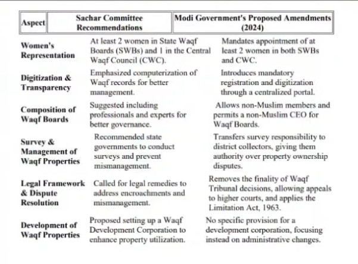
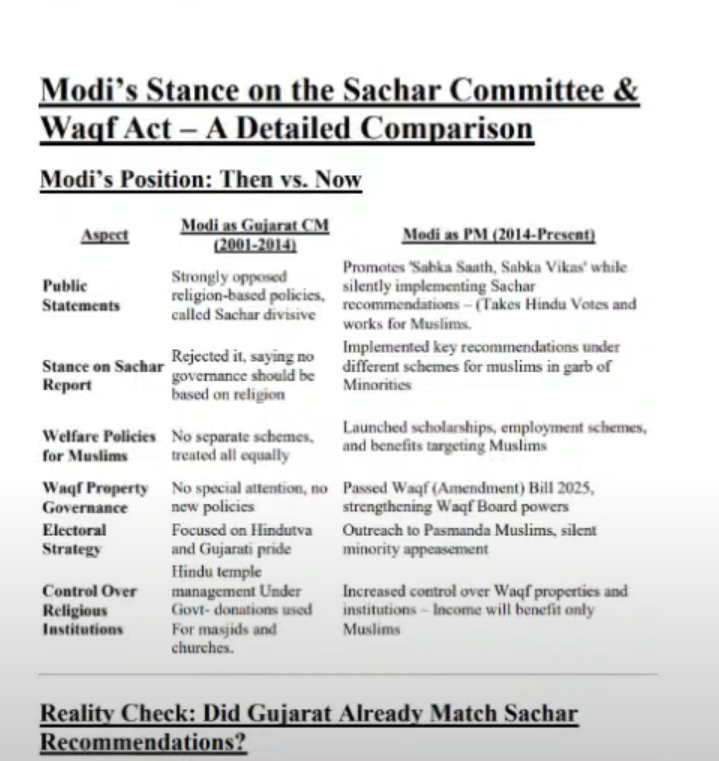

Waqf

Sachar Committee 

https://youtu.be/cn4InamE8q8?t=1740

https://youtu.be/hNn5i0zo8lQ?t=561

https://www.minorityaffairs.gov.in/WriteReadData/RTF1984/2286191517.pdf

https://youtu.be/hNn5i0zo8lQ?t=625

Whats app(Whatsapp university)
https://youtu.be/vuOJIeaSnLY?t=91

This is simply an attempt to derail the analysis of the new Waqf law.

JPC Chairman, Jagadambika Pal, says Non Muslims are a part of the Waqf, because of Sachar committee.
And at the same time, Home Minister Amit Shah says Non Muslims are NOT a part of the Waqf.
https://youtu.be/vuOJIeaSnLY?t=140

Why are Hindus are made to dance Begani Shaadi Mein Abdullah Deewana
https://youtu.be/vuOJIeaSnLY?t=165

The entire Waqf property till 2025 is now legalized.
https://youtu.be/vuOJIeaSnLY?t=295

How hindus are being played football.  
https://youtu.be/vuOJIeaSnLY?t=320

https://youtu.be/vuOJIeaSnLY?t=509

Kiran Rijiju says, I will get blessings of crores of Muslims.
https://youtu.be/vuOJIeaSnLY?t=455

Fool Hindus 
https://youtu.be/vuOJIeaSnLY?t=510

https://youtu.be/vuOJIeaSnLY?t=548

21 lakh acre of land out of 39 lakh acre of land is acquired by Modi Sarkar after 2013.
By digitalizing it, they legitimized the Waqf
https://youtu.be/vuOJIeaSnLY?t=590

From 1913 till 2013.
https://youtu.be/vuOJIeaSnLY?t=678

From 2013 till 2025.
https://youtu.be/vuOJIeaSnLY?t=713

Amit Shahs Statement
From 1913 to 2013, the total waqf properties in acere is 18 lac acre.
From Then on 30 lac acre increased. This Jihadi Amit shah is proudly and clearly stating.
https://youtu.be/prxTRuxMjCM?t=2309

When Modi was CM of Gujarat, he used to oppose Sachar committee saying it is divisive, and he even went to court to stop that being implemented. 
https://youtu.be/vuOJIeaSnLY?t=810

There are 300 schemes are run directly from PMO office, that include Haj subsides 
https://youtu.be/vuOJIeaSnLY?t=835

https://www.youtube.com/watch?v=eSv4cD4u8JU
Sushil Pandit
Waqf Amendment Bill "अल्पसंख्यक हैं तो सिर पर बिठाए जाएंगे,इसके लिए ये कृतज्ञ नहीं बल्कि हथौड़े ..."

Same drama with triple Talaq, Teen Talaq, Article 370, RamjanmaBhoomi 
https://youtu.be/eSv4cD4u8JU?t=21

Dear hindus,
Hold your seat belts..
Waqf 1995 act was not just supported by BJP but it's MP Ram Ratan had moved an amendment that the "law of limitations" shud not be applicable to #Waqf properties!
So BJP has been in cahoots with congress in passing this Waqf bill since 1995
https://x.com/RituRathaur/status/1572283708560003073

Source of information...In his book while praising ABV and BJP, 
he writes about the proceedings of parliament in 1995 when Waqf act was passed and thanks BJP MP Ram Ratan for getting the "law of limitations' added to WAQF act...
https://x.com/RituRathaur/status/1572495430956748801

WAQf Kudha ki sampati hai, ...Desh ki nahi? Who is saying this? Uttar Pradesh Alp Sankhak Kalyan Mantri DharamPaal Singh.
https://x.com/RituRathaur/status/1572474166120677376

BJP IT celliyas wrote threads on how anti hindu congress under PVNR brought WAQF act of 1995 ..
But they hid from you was that BJP fully supported this act and proposed the most draconian amendment too
Now let's see how many call BJP anti hindu
https://x.com/RituRathaur/status/1572600982319804417

Minority (Muslim) Appeasement by BJP (2014-2019)
Stats by:Amit Shah Ji

1. #Scholarships
Before BJP came into power in 2014: 
In 50 yrs only 2crore 66 lakh M students got scholarships

After BJP came into power:
3cr 82lakh Minority got scholarships in 5yrs

Humongous rise
https://x.com/RituRathaur/status/1572925567204495360

Minority (Muslim) Appeasement by BJP (2014-2019)
Stats by:Amit Shah Ji

3. #SkillDevelopment 
Congress gave skill development to only 20000 minority youth

BJP in just 5 years:
Gave skill Development to 600000(6 lakh) M youth 

Watch it Hindus
https://x.com/RituRathaur/status/1572927544667820032