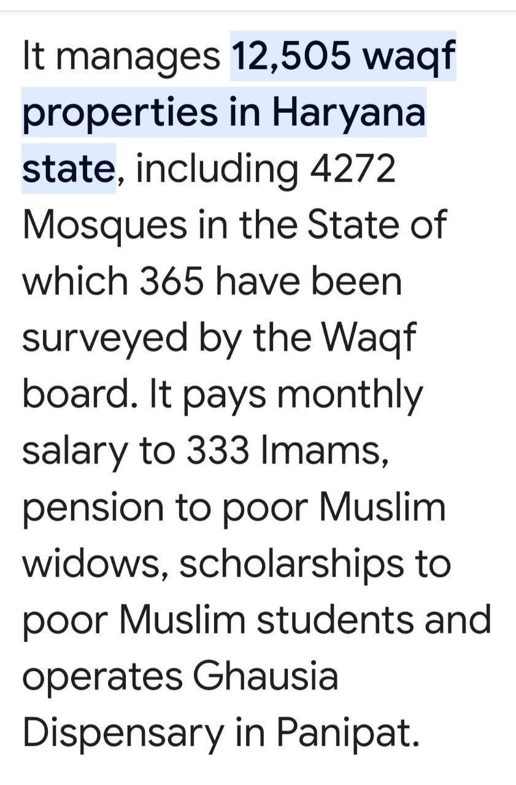
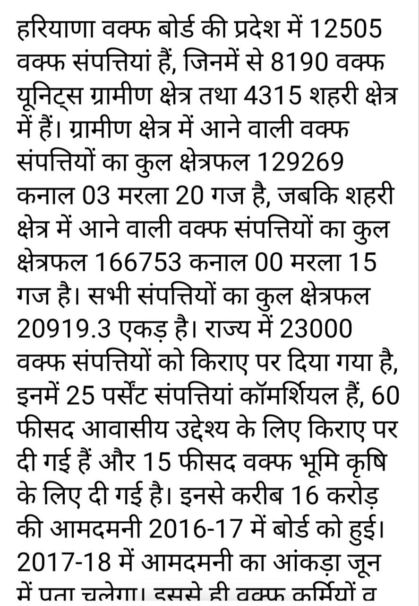

# Mewat Hariyana Riots

## About the insident.
1. Happened at Mewat, Hariyana, India on 31st July 2023.
2. Such big roits happened after **30-31** years.
3. Preplanned, similar to Kashmir and Godra.
4. In a temple, where around 2000+ unarmed women, children are present, the roiters attempted to surrond them and finish them.
5. Including police, 5 got killed.
6. Thousands of vehicles are set on fire. Also many shops and houses.
7. These roits could have escalated to the entire country.
8. The government is BJP RSS Double Engine Sarkar both at the state level and the center. 

## Objective. 
1. This write up attempts to do an RCA, the Root Cause Analysis of why this happened.
2. What were the policies adapted by the BJP RSS Khattar Sarkar, that lead to this insident.
3. What pravoked these roiters, what empowered, that this happened after 30 years. Who gave the fuel to them?

## Root Cause Analysis.
1. BJP RSS HindutvVadi Khattar Sarkar started giving permission to do Namaz publically at various places. In 2021, the conflict started to emerge as hindus started opposing this. Protesting Hindus were thrown in Jail, but ultimately the permission was lifted in 8 locations due strong Hindu Protesters pressure. The BJP RSS HindutvVadi  Khattar Sarkar thus started provoking these Vunmadies.

2. The BJP RSS HindutvVadi Khattar Sarkar then started giving salaries to Maulanas. This year this BJP RSS HindutvVadi Khattar Sarkar increased the salary by 50%. There is more, they also promised an year on year increment of 5%. Essentially, since the 1st step failed, govt started to empower the Jihadi Maulanas more and more. The idea is simple, ***more the Hindus are in fear, they will vote BJP***. These Jihadi Maulanas even honored the BJP RSS HindutvVadi KhattarJi 

3. Now land empwerment. Land jihad. 

   1. This is extremely rampant now in Hariyana. There are around 12505 registered and notified waqf properties in the State.
    
   2. So basically Waqf is give the free hand.
   . Enabling to Encroaching land in every village by the double engine sarkar. 
   3. Doing business out of that properties and emmasing wealth. Now its has surplus budget.
   
4. With the BJP RSS HindutvVadi Khattar Sarkars Abhaya Hast, the stomachs are full, things are ready. They just wanted a trigger, and that is the treditional BrajMandal Yatra, this started, they are ready, Riots started.

## Referneces
1. https://www.abplive.com/states/delhi-ncr/namaz-will-no-longer-be-held-in-these-8-public-places-in-gurugram-administration-withdraws-order-amid-protests-1991694
2. https://hindi.opindia.com/politics/haryana-imam-maulana-salary-50-percent-increase-waqf-board-felicitated-cm-manohar-lal-khattar/
3. https://www.opindia.com/2023/01/haryana-cm-manohar-lal-khattar-announces-50-hike-in-salary-of-muslim-clerics/
4. https://www.abplive.com/states/punjab/haryana-news-imam-and-maulana-honored-cm-manohar-lal-khattar-to-increased-honorarium-in-gurugram-university-ann-2300787
5. https://www.haryanawaqfboard.com/site/properties
6. https://www.prharyana.gov.in/en/the-haryana-state-waqf-board-is-the-first-waqf-board-in-the-country-to-take-a-lead-in-gis-mapping-0
7. 

## Summary.
1. The BJP RSS HindutvVadi Khattar Sarkar is a Jihadi Sarkar. 
2. Things will be worse as we go ahead. 
3. BJP is not for Hindus. The sooner Hindus realize the better.
4. 