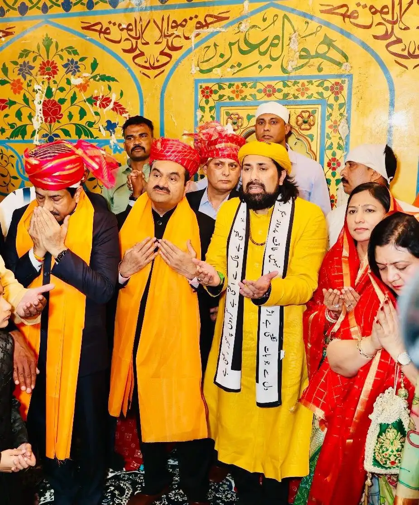

1. Introduction
2. Defining and Explaining SubVersion
3. Subversion Of India By Rss Through Relegious means, deep state etc.
4. Role of our leaders and how our leaders became Rss agenst.
5. Consequnces of 

How hindus saints are treated by RSS Gang
https://www.youtube.com/watch?v=pUMwwXHkx2Q&t=417s

Autul Sbhashcase. Dreconinan laws aganest men. If our leaders had the right intentioin, they would have amended the laws. This govt has absolutely no intention of working for Hindus.
Why do I say so
They would have done it in the last 10 years.
They clearly know that the hype will die down. Just wait for it, and it will die down.
Muslims have their own personal law board.
This establishment and their idological parent have no intention in the first place. Why have strengthed SCST act. And RSS did not oppose it.

This is an era of instutionial capture.
https://youtu.be/I9QaTZzgECk?t=1265

Life of an average man. Hopeflation. Priced out of Marriage, family, love 
https://youtu.be/qC6hBIYJlGA?t=725

https://www.youtube.com/watch?v=EEjMe5CVY04
The reality of 
Aviation Industry in India: Airports Shutting Down, Ticket Prices Up | Ajay Prakash | Speaking Minds
Even the rail travel is gone out of reach for common people. 

https://youtu.be/EEjMe5CVY04?t=166

144 year Maha Kumbh, appeared after 12 years.
https://www.youtube.com/watch?v=bEEgPVn1o7M

Iskcon leaders are unfit for politics.
1. Because our leaders think that politicians are straight fwd. Politicians are not.  
2. Our leaders do now know how to face and nogitiate with duplicitous leaders. They are trained for that.

The curious care of Kerala
For decades, left ruled Kerala. Infact a communist political party won in Kerala, which is first in the world. 

But they could not erode the culture of kerala.

Joke Cartoon

A group of deep state guys are in a secret meeting, discussing Kerala. 
One of them says the communist party failed in their mission.
Another says now its time to install BJP. And another thinks in his mind, add ISKCON to mix, and it would do wonders.
 

Iskcon has become a bunch of betas who relish blue(or red pills, not sure) pills.

You can get quite far in a democracy if you can convince a majority that they are victims of a minority, and that only you can protect them.

https://x.com/Kasparov63/status/756503082448654336
Garry Kasparov Russian Chess Grand Master

https://youtu.be/jvTUZueX8O4?t=18

Nice article.
https://theaidem.com/ajay-kamath-islamophobia-majoritariansm/

Stockholm syndrome and useful idiots. 

