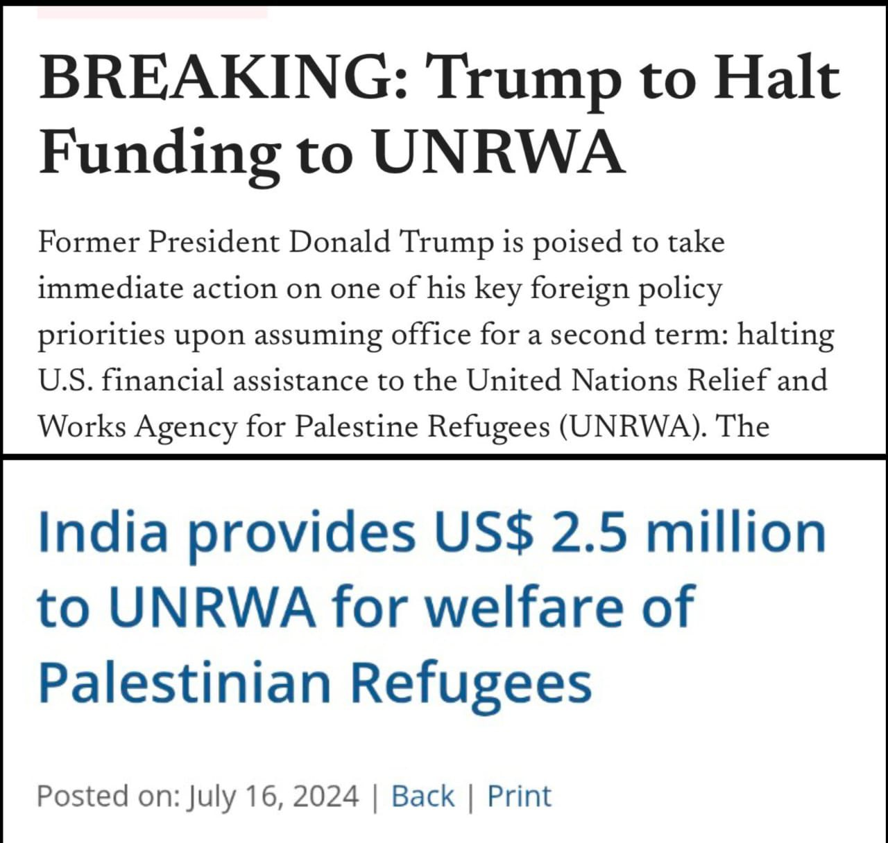

US President Donald Trump Vs PM Modi | @indisapeaksdailyISD | Sandeep deo | Ritu Rathore

https://www.youtube.com/watch?v=I6Q8yXTT1uE

1. Donald Trump did not forget his supporters. Those who attacked capitol hill in support of Trump in after election results in 2021, were all relived of their charges as soon as Trump came to power in 2025

2. More over, 400 accused(abhiyukt) and sentenced were all quashed of their charges and sentences. 

3. Never his entire life, Modi stood for Hindus. Bangladesh Hindus were targeted and killed, 300 Hindus were killed in Gujarat Firings, Praveen Togadia says. 59 were already dead in train fire returning from Car Seva.
https://youtu.be/I6Q8yXTT1uE?t=100

4. Ex-IPS officer Vanzara was thrown in Jail for 9 years, and Modi did not do anything.
https://youtu.be/I6Q8yXTT1uE?t=129

5. Maya Kodnani, who is a member of Gujarat Legislative Assembly, a minister was thrown in jail, 
https://youtu.be/I6Q8yXTT1uE?t=130

6. Sarkar Hamari Hain, lekin System Unka Hia, this is a standard, Trump did in one shot.
https://youtu.be/I6Q8yXTT1uE?t=148

7. Congress always saves its people. In 2004, when its govt has come, it has changed 21 governors 
https://youtu.be/I6Q8yXTT1uE?t=168

8. In one day more than 80 executive orders, karyakari aadesh.
https://youtu.be/I6Q8yXTT1uE?t=250

9. Javier Gerardo Milei, Agentina present also made seeping changes. 
https://youtu.be/I6Q8yXTT1uE?t=280

10. Modi is not invited by Trump for his ceremony, 
https://youtu.be/I6Q8yXTT1uE?t=439

11. Jay Shankar got invited from the Trumps Vance committee, means, he purchased ticket. So Modi is no more a world leader. There after drama by the Godi Media.
https://youtu.be/I6Q8yXTT1uE?t=620

12. This could have been handled differently. George Fernandez thrown cocacola company out of India. 
https://youtu.be/I6Q8yXTT1uE?t=680

13. Whats app university, whatsapp groups, media social media, masterstroke wadi ecosystem. 35 lakhs lacs whatsapp groups, means around 30 crore people direct reach. We are living in an extreme era of misinformation.  
https://youtu.be/I6Q8yXTT1uE?t=770

14. Henry Kissinger vs Indira Gandhi is a bitch. Indira Gandhi commented about the vietnam war.
https://youtu.be/I6Q8yXTT1uE?t=870

15. Indira Gandhi, with all her faults, is a nationalist, never compromised with her countries interests.  
https://youtu.be/I6Q8yXTT1uE?t=898

16. Sarkar Hamari hai lekin system unki hai. Trum disproved it. Trump did what he wanted to, even the entire system is against him. 

https://x.com/RituRathaur/status/1881647766490997113

https://youtu.be/I6Q8yXTT1uE?t=930

17. Trump Sealed the border, with one of the executive orders, but Modi, Rohingyas and Bangladeshis increased. 
https://youtu.be/I6Q8yXTT1uE?t=1070

https://www.ndtv.com/india-news/saif-ali-khan-attacker-bangladeshi-shariful-shehzad-father-worked-for-khaleda-zias-party-saif-ali-khans-attackers-father-to-ndtv-7548597

18. 

