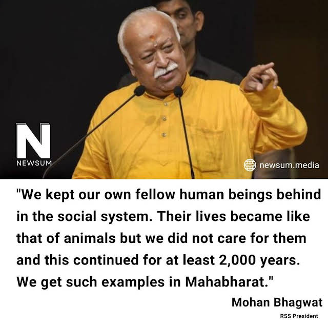

The moron in action yet again.

Ooh ...This stinking and rotting state of mind says

We kept our own fellow human beings behind in the social system. Their lives became like that of animals but we did not care for them and this continued for at least 2,000 years.
We get such examples in Mahabharat.

Hmnn... MAHABHARAT!!!

From where in Mahabharat you ask?  How dare you ask such a question?

Ok, Please bare with me for the following, because I am not the one who is saying it. Its again an Ex-Sanghi.

"ये जब भी मुँह खोलता है, तब विष्ठा ही करता है"

So - "If there is one ideology that is dangerous to this country today, thats RSS."

And you know, there is a fun fact to this particular point. Believe it or not, this is said by none other than our own Pappu - Rahul Gandhi. How true it is?

Bit serious, The idea is simple, more you undermine our scriptures, the more you become acceptable by the left and the west. As I already mentioned, this is an anti intellectual moment. No books, no reading. Just roaming around and crapping.

Does he have any guts to speak against Islm and Chistnity?

Now, for those living in a cave, Ex-Muslim movement is in rage these days. Anonymous Ex-Muslims are all over the place converting others into Ex-Muslims

I am thinking isn’t this the right time for an Ex-RSS movement? So, what do you think? Or its already happening?

And yaa, Ayeaga to Modi hee. The great Mass Hindu Hypnotizer. Who can beat him? Especially with Rahul Gandhi as opponent, his greatest strength!!

Har Har Modi, Ghar Ghar Modi.

Ref1: https://www.youtube.com/watch?v=srYYJ0Mo7tc&t=59s

Ref2: https://newsum.media/reservations-should-continue-as-long-as-there-is-discrimination-in-society-rss-president-mohan-bhagwat/

https://www.youtube.com/channel/UCUnYd8AViF5MpVVisqd_KzA/community?lb=UgkxIAR6PdB84LvwgwT15sAGaeGDY5J3SPQx

https://yt3.ggpht.com/lgBqnf4y8ttVueRfAAbxINHggbMLRRV9lyQprhf_GyJtO2fOOKH_Dt_iYMb-BNFI7rv6KGF7Vd6a=s640-nd-v1

https://youtu.be/pPQc3Zi1Em0?t=489

Some fun points.

Creation of Mandal Commission (1979) Jan Sangh-Janata Party government.

Mandal Commission implemented (1990) by BJP supported VP Singh government.

Unconstitutionally opened the way for Muslim and Christian reservation through Mandal Commission (1990) BJP supported VP Singh government.

SC/ST implemented (1989) BJP supported VP Singh government.

The list of SC/ST Act increased from 22 to 47 crimes (2015) Modi Government

Supreme Court's decision on SC/ST reversed (2018) Modi government by an ammendement.

If you think any of the above points are wrong, do let me know

And there is more.

Do you know who suffers the most because of SC/ST act?
