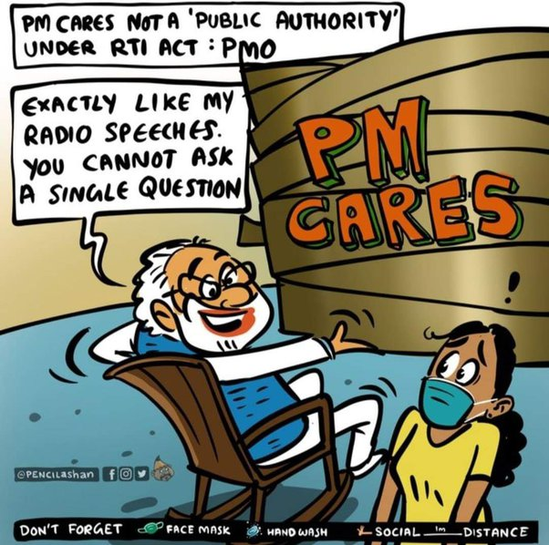

## Former CBI Director Nageswara Rao Interview with Vishal

https://twitter.com/MNageswarRaoIPS/status/1776285336932372769

## Part 1

BJP Mukt Bharat.
4 PM Live : Former CBI Director M Nageshwar Rao Explains 14 Reasons to Vote Out Modi Govt
https://www.youtube.com/watch?v=BRQFB2vKgmU&t=19s

1. Its a question of survival of Hindu Civilization which is under threat due to RSS and BJP.

14 Reasons to Vote Out Anti-Hindu #Modi Sarkar.

1. # ModiSarkar is undoubtedly the most corrupt govt.
BJP is undoubtedly the most corrupt party and government. All its talk of NA KHAUNGA NA KHANE DUNGA is humbug
https://youtu.be/BRQFB2vKgmU?t=91

Most corrupt, not just BJP Govt, but also the BJP Party.
https://youtu.be/BRQFB2vKgmU?t=200

Electoral Bond Scam.
https://youtu.be/BRQFB2vKgmU?t=237

Electoral Bond Quid Proco.
https://youtu.be/BRQFB2vKgmU&t=282

Every payment that is made to BJP is either directly linked to a favor or to prevent any action by the law enforcement agencies.
https://youtu.be/BRQFB2vKgmU?t=393

Money laundering scheme.
https://youtu.be/BRQFB2vKgmU&t=435s

BJP Washing Machine. Since 2014, 25 Opposition leaders facing corruption probe switched to BJP, 23 get reprieve. Misusing Law enforcement agencies.
https://youtu.be/BRQFB2vKgmU?t=447

Bhrastachari Janata Party.
https://youtu.be/BRQFB2vKgmU?t=515

Amendments made in 2018 to Prevention of Corruption Act  are at variance with this emotional speech of Modi Ji.
Ability of CBI & all State Anti-Corruption Bureau is destroyed as they canNOT start even a preliminary enquiry against even a peon without prior order of Govt etc.
https://twitter.com/MNageswarRaoIPS/status/1599665241268588552

In 15 years, RTI has gone from Indian Citizens' most powerful tool to an Act on Life support.
https://www.youtube.com/watch?v=BRQFB2vKgmU&t=532s
https://theprint.in/opinion/in-15-years-rti-has-gone-from-indian-citizens-most-powerful-tool-to-an-act-on-life-support/447507/

In here, the Retired Director says an important point.
Say someone accuses me of some corruption.
Then if I request CBI to do an enquiry on me, the CBI will not be able to do anything. Why? because it needs permission.
https://www.youtube.com/watch?v=BRQFB2vKgmU&t=648s

They have systematically destroyed the anti-corruption mechanism in the country.
https://youtu.be/BRQFB2vKgmU?t=661

Double talk and hypocrisy never happened in this country.
https://youtu.be/BRQFB2vKgmU?t=683

Do you know that PM Cares fund is out of RTI?
PM Cares Fund.
https://youtu.be/BRQFB2vKgmU?t=700
https://indianexpress.com/article/cities/delhi/pm-cares-fund-public-authority-rti-act-centre-delhi-high-court-8414937/

Selling out India.
https://youtu.be/BRQFB2vKgmU?t=836
https://frontline.thehindu.com/the-nation/air-india-sold-to-tata-group-for-a-song/article37255654.ece

Dwarka Expressway: CAG flags very high cost for NHAI project in Delhi as budget escaltes by 14 times.

https://youtu.be/BRQFB2vKgmU?t=972

