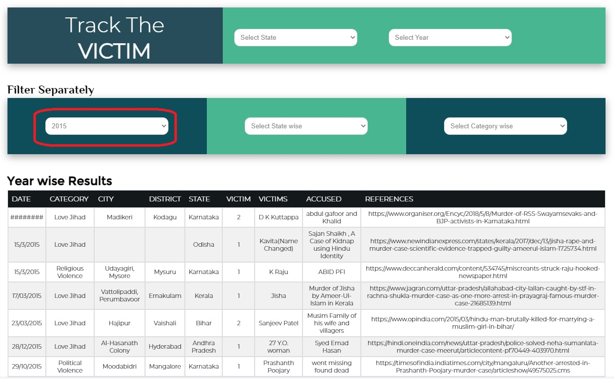
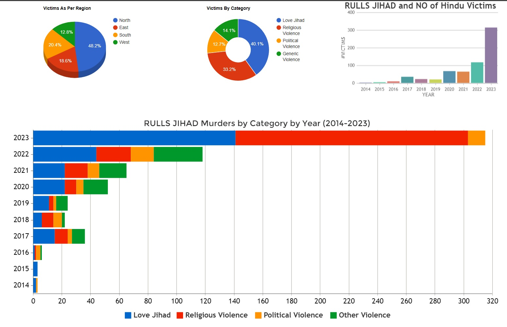

RULLS database

Random Unceasing Low Level Scattered Violence

https://www.thejaipurdialogues.com/rulls/

https://www.youtube.com/watch?v=Y6E0lmgp1TA

https://www.thejaipurdialogues.com/rulls/

The number is staggering. 
Amrutkaal इमरतीलाल का अमृतकाल! || #ISD || Sandeep deo || Akshay Kapoor || Dr. Shilpi Tiwari
https://youtu.be/tVhtAQVMQXc?t=211

-----------------------------------------------------

Respected Prabhuji.

Please Kindly be patent. I am talking based on data.

Please look at the following database. Its scary to say the least.

Its called RULLS. Has anyone of you heard of this before?

It stands for Random Unceasing Low Level Scattered Violence. Key words here are Random and Scattered.

Please take the following steps one by one patiently.

1. Visit https://www.thejaipurdialogues.com/rulls/ web page on a computer and not on a mobile. It will be too small to see on mobile. 

2. Note, if you have a VPN, you may need to turn it off. With my company VPN in place, this page is not showing up. I had to turn it off to see this page.

3. Please read what they are saying about this page. Then scroll down till you see Track The VICTIM and Filter Separately section as follows.

4. Try applying some filter using drop downs, you should see some table data being populated below it. Sometimes no data may show up, may be due to no data present for that filtration. 

5. I am not sure; the filtration is working 100% correctly. But most of the time it showing some data.

6. In the last column you should see references. Try copying some of the urls there and paste it in a browser to ensure they are not broken.  

7. Take some time and study this data. Again, on a computer not from a mobile. 

8. Scroll down till the end. You should see some analytics, stacked bar, and donut charts. Please take time to study them as well. It’s not very thorough but should give some idea.

Ok. Now some questions that may arise.

About authenticity of this data. 

Firstly, the links given in the references. They seem to be correct. I checked many of them.

Secondly, is there a possibility that this analytics is manipulated to show that its increasing from 2014. Possible. Maybe I dont know. 
But I do trust The Jaipur Dialogs founder Sanjay Dixit Ji. He is an Retd. IAS officer and I used to listen to his Videos. 
Please note that he still talks in favor of Modiji and not against him like I do. 

So lets assume that this data is valid and correct. Now a few thoughts from my side.

As you can see, they are steadily increasing. And I dont think it will come down any time soon.

I tell you why. The Supreme Court gave 2.7 acre to winning side and 5 acers to the loosing side.

Just now we all celebrated Lord Ram festival. Everywhere there are flags and festive mode never seen before.

Now close your eyes and think about this. Do you know what the other side is thinking. If you think about it, its no brainer. 

Their kids are provokingly saying - we are just waiting to see how big your temple will be. We will build bigger one.

With endless stream of funds, they are rapidly buying the surrounding properties with the aim of reaching the Main Ram temple in 5 years.

So what do you think the trend of the above graph data in RULLS will be for this year?

Its an emmergency out there. 

Is there right to self-defense. Are we safe? Are our families safe? Can we follow our religion?
The answer for all of the them is resounding NO.

So therefore I say, Achee Din, Amrut Kaal, Ram Rajya are simply Jhumle for me. 

Please understand, given my position, its difficult to put my point and you are making it even more difficult.

Without patience we will not go anywhere. 

So please kindly calm you mind, I believe the following Aarabhi pasuram should help.

Thirupaavai Day 3, Ongi Ulagalandha- Arabhi- Kunnakudi Balamurali Krishna and Akkarai sisters

https://www.youtube.com/watch?v=V9lRfc0VkXk

