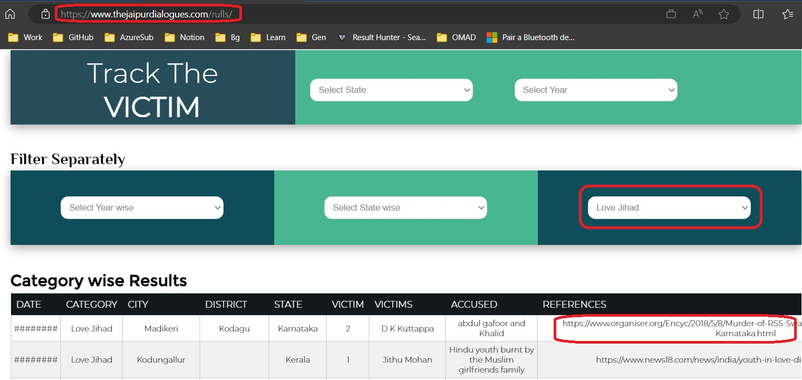

RULLS database

Random Unceasing Low Level Scattered Violence

https://www.thejaipurdialogues.com/rulls/

https://www.youtube.com/watch?v=Y6E0lmgp1TA

How many of you came accross RULLS database?

RULLS stands for Random Unceasing Low Level Scattered Violence

Take a look at the following link. Open in a computer and not on a mobile. You can filter and get the links and details of news articles as well. 

https://www.thejaipurdialogues.com/rulls/

Right to self defence.
Are we safe, Are our families safe, and can we follow our relegion. 
The answer for all of the three is resounding NO.
The number is staggering. 
Amrutkaal इमरतीलाल का अमृतकाल! || #ISD || Sandeep deo || Akshay Kapoor || Dr. Shilpi Tiwari
https://youtu.be/tVhtAQVMQXc?t=211

