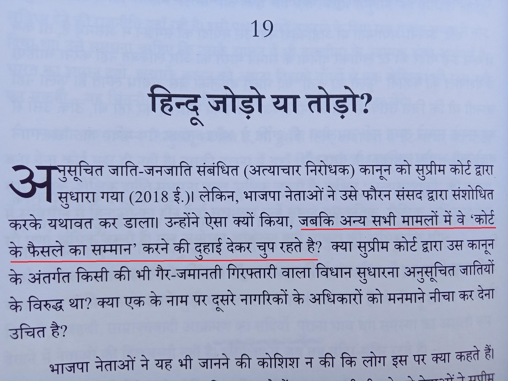

The draconian SC/ST act.

Just the name sends chills down the spine.

In March of 2018, the Supreme Court gave a judgment, that without investigation, there should be no arrests.

https://main.sci.gov.in/supremecourt/2017/22086/22086_2017_Judgement_20-Mar-2018.pdf

But guess what, our Hero is restless. What do you expect from a jihadi? Just look at the history, what did they do?

And yes, He said, we will not allow its dilution
https://indianexpress.com/article/india/pm-modi-on-sc-st-act-verdict-we-will-not-allow-its-dilution-says-pm-modi-ambedkar-memorial5136402/

https://timesofindia.indiatimes.com/india/wont-allow-dilution-of-sc/st-act-pm-modi/articleshow/63754523.cms

If you remember, I referred to a book by Prof Shankar Sharan with title 
Sangh Parivar ki Rajneeti: Ek Hindu Aalochana
https://www.amazon.in/-/hi/Shankar-Sharan/dp/B0B9Y8Q9FW

The last chapter of that book does a thorough analysis on this subject.

Whenever it fits their jihadi agenda, they say Supreme Court Kaa Sammann. But when its not, they do not hesitate for amendments or even ordinances(Modi hain toooooo.... )

So the govt. reverted the judgment. 

As a consequence, using this act, today we have harassment, land grabbing, killings and what not.

A simple question. Which one of the following do you think is easy today?

1. Killing a mosquito in your house.
2. Killing a Pujari of a small temple in UP Village.

I dont want to elaborante on this.

Should I talk about the One and Only Our Great 108 Mohan Bhawats statements around this now? No, I will spare you all with that for today. 

Ok, so even lawyers and judges are not spared, take a look at the following.

https://hindi.livelaw.in/category/top-stories/allahabad-hc-orders-cbi-probe-into-fake-cases-lodged-against-advocates-206898

What it means is, if I want to hire a lawyer, a case will be filed on that lawyer, again under SC/ST,  so I will never be able to even defend my case.

And... there's more.

I even heard cases in which poor family daughters are targeted while threatening SC/ST cases against parents. So a new form of love jihad!! 

Welcome to New India!!!

It's depressing right? Hmm…

But it looks like there is some hope. Without hope there is depression.

Stay tuned....

