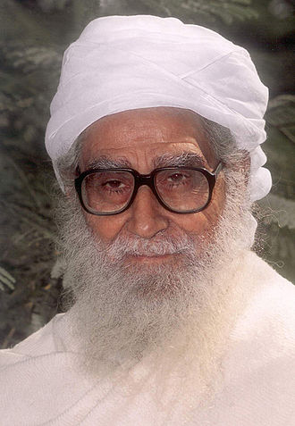
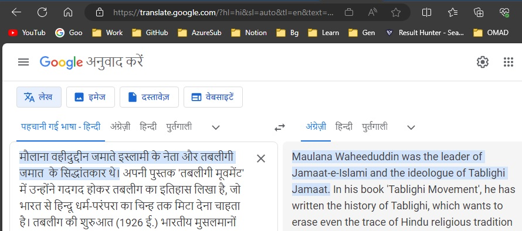

Ok, so here is the second reason. 

I had introduced you all to RULLS violence. For months I was wondering how we got so far with this Jihadi violence. And recently got some clues.

So let me introduce you all to Waheeduddin Khan.

Quickly go through this wiki article about him. https://en.wikipedia.org/wiki/Wahiduddin_Khan (Ref 1)

What's wrong... Everything is peaceful right? 

Yaa...but Thats wiki. Will you trust it? We need to dig deeper.

If you remember I had referred you all to Prof. Shankar Sharan and his book some months ago. - "Sangh Parivar ki Rajneeti: Ek Hindu Aalochana." Have any one of you gone through it? See Ref 2

Here is another essay published by Prof. Shankar Sharan. See Ref 3. 

This essay actually gives us a true picture of Waheeduddin.

Do take time to thoroughly read it. Its very important and informative as well. Please dont skip this.

Its in Hindi. Use google translate in the following way for English.
https://translate.google.com/?hl=hi&sl=auto&tl=en

Three excerpts I picked from the essay are as follows.

------Start------

The 'ideal' 'nationalist' Muslim of the Sangh Parivar was Waheeduddin.

The irony is that those whom Congress and Sangh Parivar glorified as 'nationalist Muslims' were staunch Islamists - Maududi, Mashriqi, Ilyas, Azad, Waheeduddin, etc.

Maulana Waheeduddin was a supporter of the plan to wipe out Hindu religion from India, this is mentioned in his book! The top leaders of RSS and BJP paid tribute to this by calling Waheeduddin's 'deep knowledge', 'religious scholarship', 'spirituality', 'social service', etc.

------End------

So you should get the idea. He is an extremist from the very beginning. Incontrast to that, he was all along presented to us completely the exact opposite. 

And who was behind the suger-coated presentation of him? Yes, its the RSS and the BJP. 
From almost the very beginning, RSS is COMPLETELY different from what it appears from outside.

So where is Modi in the picture you ask... 

Waheeduddin was given the Padma Bhushan by Vajpayee right in the beginning of Vajpayee's term in Jan 2000.
Then he was given the Padma Vibhushan, the second highest civilian award by non other than Modi in Jan of 2021. This is mentioned in Shankar Sharan's article(Ref 3) as well the wiki(Ref 1) 

So is Modi(and Vajpayee) unaware of the true colors of Waheeduddin? Is Modi so innocent that he just saw the wiki article and presented with the Padma Vibhushan? Think about it. 

This is why I call Modi a Jihadi. Just like Vajapyee, Gandhi. They know everything, dont they?

What do you think?

References

1. https://en.wikipedia.org/wiki/Wahiduddin_Khan

2. Sangh Parivar ki Rajneeti: Ek Hindu Aalochana. 
https://www.amazon.in/-/hi/Shankar-Sharan/dp/B0B9Y8Q9FW

3. संघ परिवार और मौलाना वहीदुद्दीन Sangh parivar aur maulana wahiduddin
https://www.nayaindia.com/main-stories/country-unaware-agenda-of-tablighi-jamaat-147712.html

संघ परिवार और मौलाना वहीदुद्दीन
Sangh parivar aur maulana wahiduddin Shankar Sharan
https://www.indiaspeaksdaily.com/sangh-parivar-and-maulana-waheeduddin/

https://en.wikipedia.org/wiki/Wahiduddin_Khan

https://hi.wikipedia.org/wiki/%E0%A4%AE%E0%A5%8C%E0%A4%B2%E0%A4%BE%E0%A4%A8%E0%A4%BE_%E0%A4%B5%E0%A4%B9%E0%A5%80%E0%A4%A6%E0%A5%81%E0%A4%A6%E0%A5%8D%E0%A4%A6%E0%A5%80%E0%A4%A8_%E0%A4%96%E0%A4%BE%E0%A4%A8

